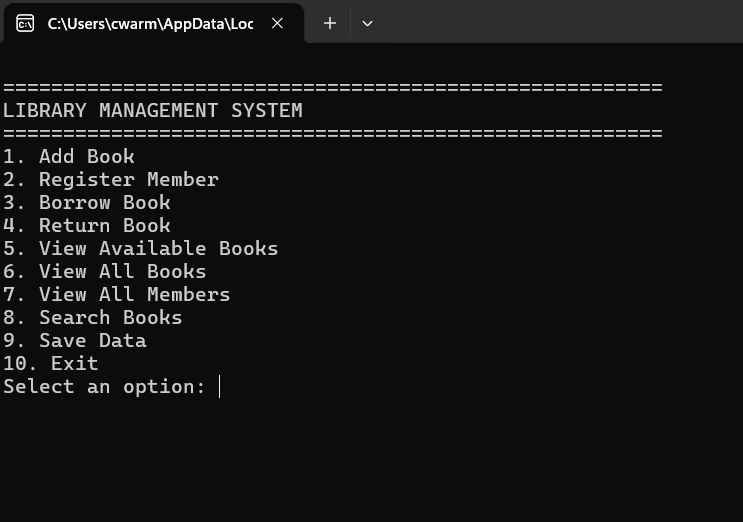
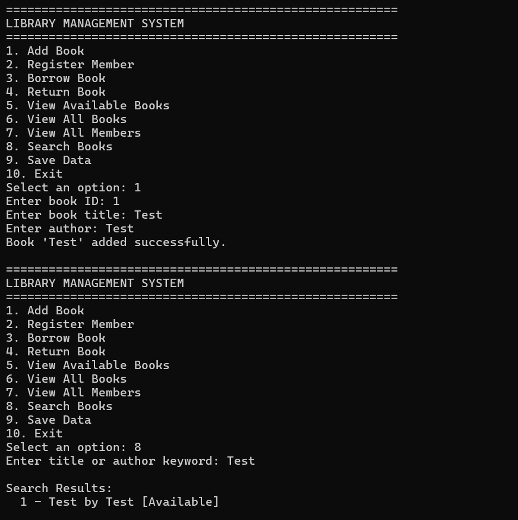

# Library Management System

## Overview
A Python-based application that manages books, members, and borrowing operations using object-oriented programming.

## Features
- Add and manage books
- Register members
- Borrow and return books
- Search functionality
- JSON data persistence
- Custom exception handling

## Technologies Used
- Python
- OOP
- JSON

## How to Run
python Library Management System.py

## Screenshots

### Menu

### Add Book and Search

## Author
Connor Warming
